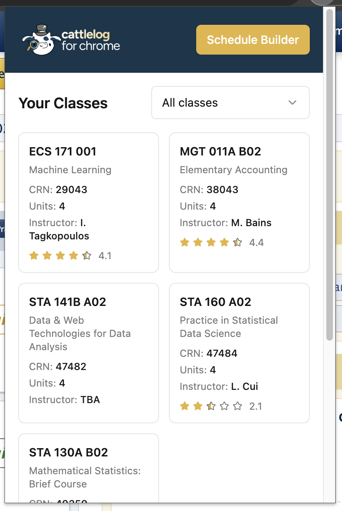
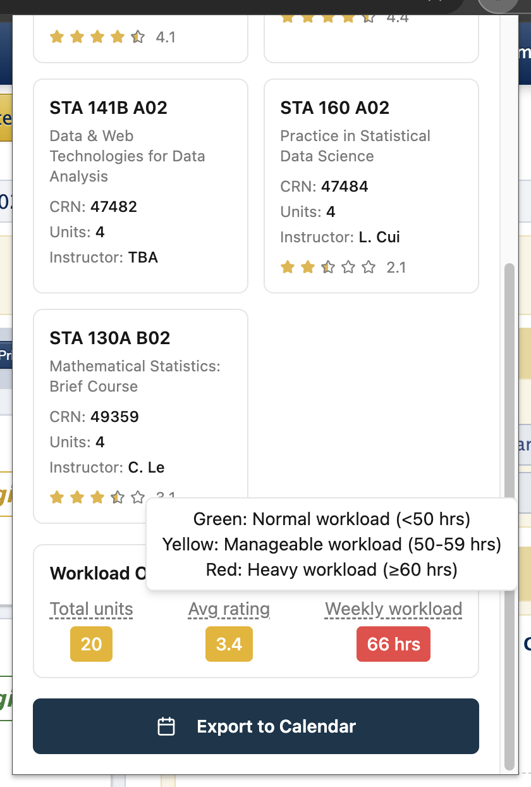
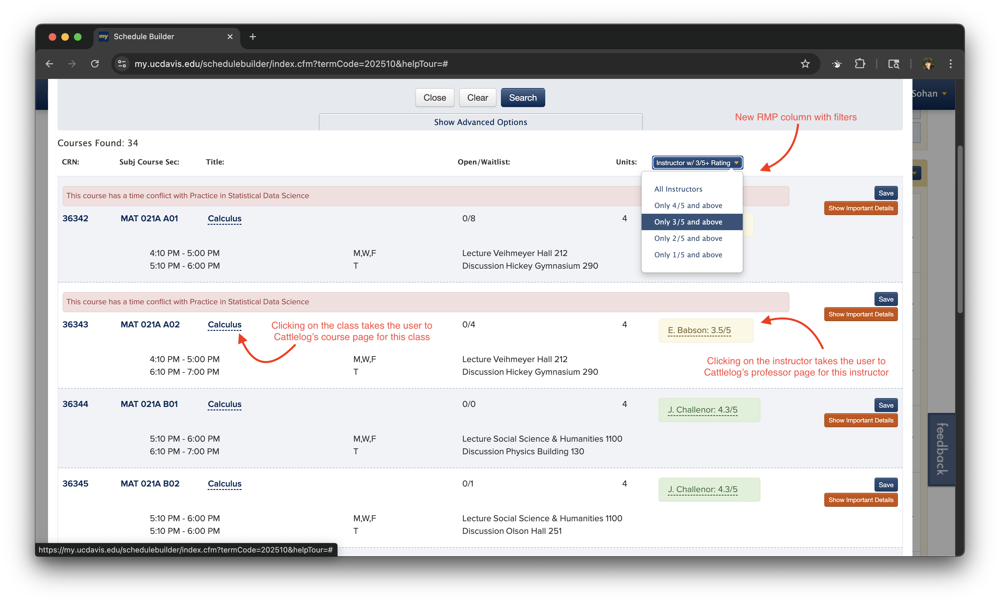
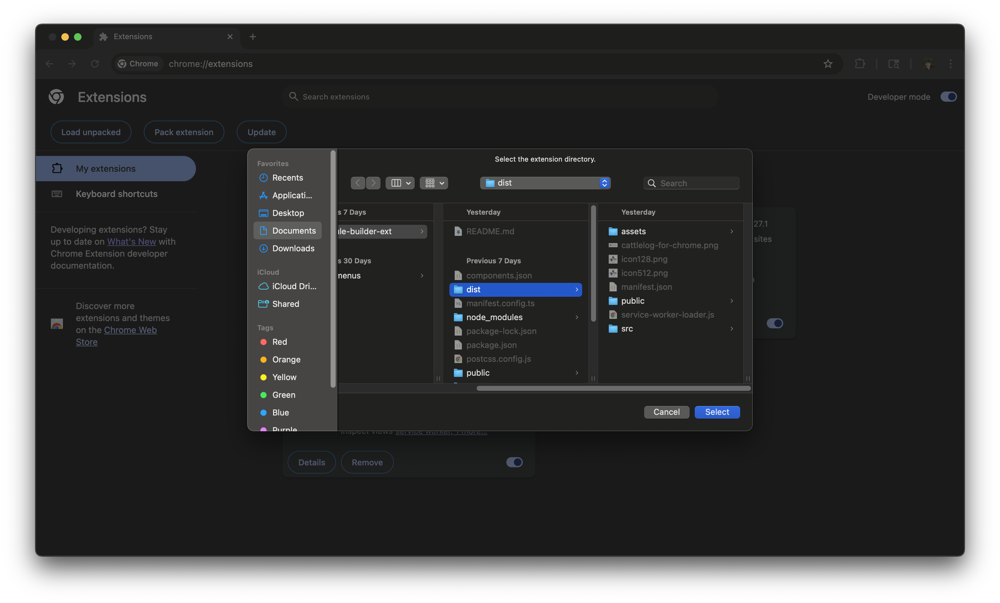
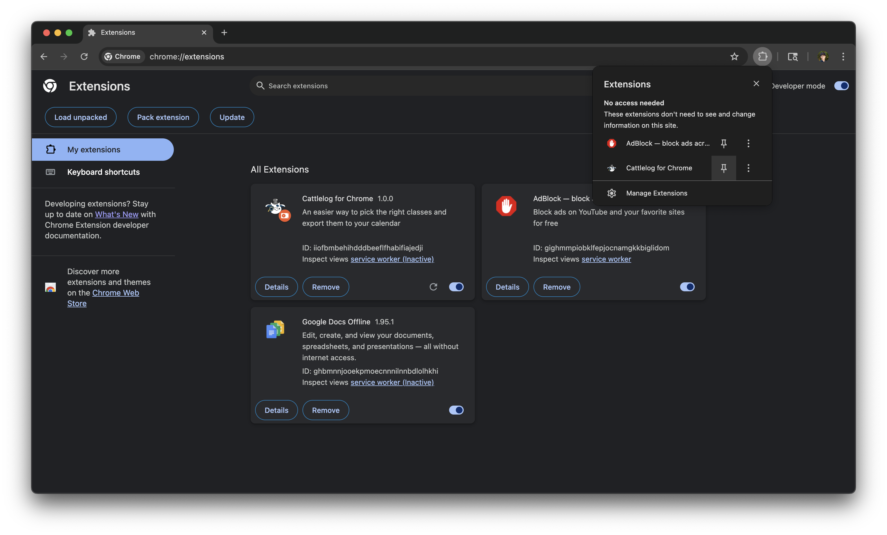

View technical architecture [here](./src/README.md).  
View Quickstart guide [here](#quickstart).

## Problem

Searching for classes every quarter is a **tedious** process.

Students have to switch between Schedule Builder and Rate My Professor to find the best
possible instructor.

**BUT** the problem is...

- Rate My Professor has a **ton of ads** that make it **difficult to navigate**
- Their website is **extremely slow** during schedule building time
- And users spend **lots of time** searching up **EVERY** professor for **EVERY SINGLE** class

## Solution / Features

| Screenshot 1                                              | Screenshot 2                                              |
| --------------------------------------------------------- | --------------------------------------------------------- |
|  |  |

### 1. Calendar Export

- Users can export their classes to their calendar of choice (Google, Apple, Microsoft, etc.)
- **_Why it's important:_** Users can **save time** from manually creating an event for each lecture, discussion, lab, etc

### 2. Estimated Weekly Workload

- Extension estimates how many hours per week a user will be spending on school
- **_Why it's important:_** Users can plan their schedule better and **avoid overloading** themselves

### 3. RMP Ratings

- Users can see professor ratings of their selected classes on the extension itself
- **_Why it's important:_** Users don't need to **waste time** switching between Schedule Builder and Rate My Professor



### 4. New RMP Column

- Users can see professor ratings for each class on Schedule Builder itself
- **_Why it's important:_** Users don't need to **waste time** switching between Schedule Builder and Rate My Professor
- **_Reminder:_** Rate My Professor's website is **slow** and **filled with ads**, making it **frustrating** to use

### 5. RMP Column Filters

- Users can filter classes based on their preferred instructor rating
- **_Why it's important:_** Users don't need to spend time looking up **EVERY SINGLE** professor to find the best one

### 6. Direct Links to Cattlelog

- Users can click on a class or professor to see more details on Cattlelog
- **_Why it's important:_** User's don't need to search for a class or professor since they now have a **direct link**
  to more details (on Cattlelog)

## Quickstart

1. Clone this repository:

   ```bash
   git clone https://github.com/AggieWorks/course-recommender.git
   cd course-recommender/
   cd chrome-ext-v2/
   ```

2. Install dependencies:

   ```bash
   npm install
   ```

3. Build the extension:

   ```bash
   npm run build
   ```

4. Load in Chrome:
   - Open Chrome and go to `chrome://extensions/`
   - Enable "Developer mode"
   - Click "Load unpacked"
   - Select the `dist` folder from this project



